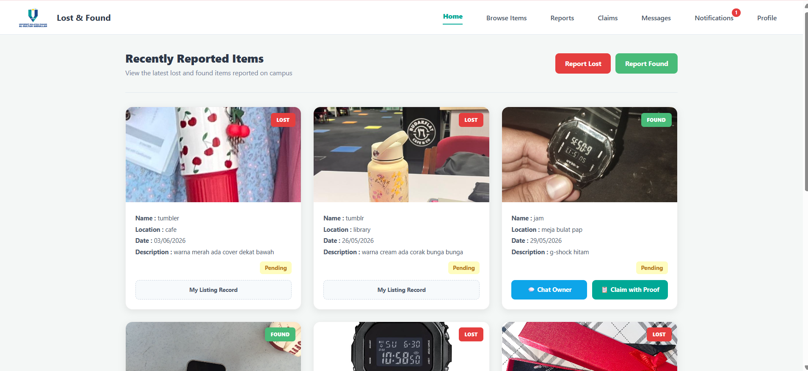

# 🔍 LostFound+ — Smart Lost & Found Management System

[](https://www.php.net/)
[](https://www.mysql.com/)
[](https://developer.mozilla.org/en-US/docs/Web/JavaScript)
[](https://developer.mozilla.org/en-US/docs/Web/HTML)
[](https://developer.mozilla.org/en-US/docs/Web/CSS)
[](https://github.com/PHPMailer/PHPMailer)

A full-stack, web-based Lost & Found Management System designed for campus communities. Built to streamline the process of reporting lost items, managing found belongings, verifying ownership through claims, and connecting users via direct communication.

---

## 📌 Key Features

### 👤 User Module
* **Authentication & Authorization:** Secure registration, login, password reset, and session management.
* **Item Management:** Report lost or found items with image uploads, categories, date, and location details.
* **Search & Filter:** Easily browse lost/found items with keyword search and category filtering.
* **Claim Workflow:** Submit claim requests with proof of ownership for verification.
* **Real-time Chat & Notifications:** Communicate directly with item finders/owners and receive status updates.

### 🛡️ Admin Module
* **Dashboard & Analytics:** Visual charts (Chart.js) displaying total reported, claimed, and pending items.
* **User Management:** Oversee registered users and system access.
* **Item Moderation:** Review, approve, or resolve lost and found reports.

---

## 🖼️ Application Screenshots

| Login & Authentication | User Dashboard |
| :---: | :---: |
|  |  |

| Browse & Search Items | Report Item |
| :---: | :---: |
|  |  |

---

## 🛠️ Tech Stack & Dependencies

* **Frontend:** HTML5, CSS3, JavaScript (ES6+), Chart.js
* **Backend:** PHP (OOP / Procedural)
* **Database:** MySQL
* **Mail Service:** PHPMailer
* **Server Compatibility:** XAMPP / Apache

---

## 📂 Project Architecture

```text
lostfound/
│
├── assets/          # CSS stylesheets, JS scripts, and static images
├── config/          # Database connection & email configuration
├── database/        # MySQL database export schema (.sql)
├── documentation/   # Diagrams (ERD, Use Case, Architecture)
├── includes/        # Reusable PHP headers, footers, and functions
├── phpmailer/       # PHPMailer library dependencies
├── screenshots/     # UI application screenshots
├── uploads/         # User uploaded item images
├── vendor/          # Composer third-party dependencies
│
├── index.php        # Landing page
├── login.php        # Authentication page
├── register.php     # User registration
├── dashboard.php    # Main overview dashboard
└── logout.php       # Session termination
